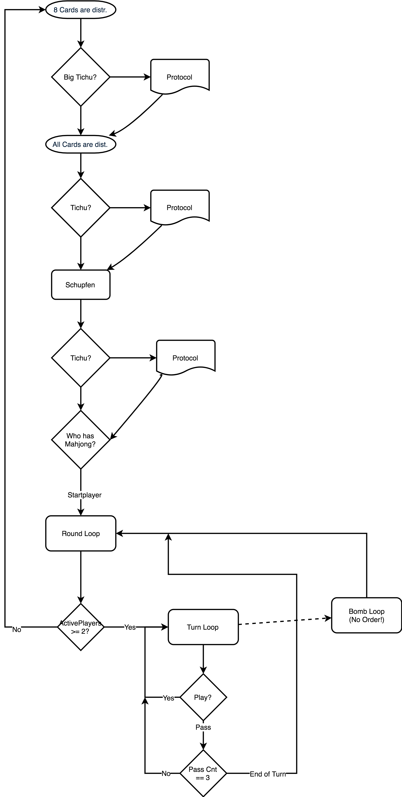

# Tichu

# Theory
## Course of the Game
As illustrated in the flow chart the game already starts during 
distribution of the cards.

* Before the 9th card is distributed every player can announce a *Big Tichu*.
* Before Schupfen every player can announce a *Small Tichu*
* After Schupfen every player can announce a *Small Tichu*

Now the course of the game starts. The player with the **mahjong** can start; 
he doesn't need to include the **mahjong (aka 1)** in his first move.

### Bombing
Bombing is possible at any time.
This yields a bit of a problem since this implies an *asynchronous
bidirectional* communication between players and the the game logic.
Without bombs the server can just ask one after another what they 
would like to play.

# Implementation
## Course of the Game
### TRound
This class should keep the necessary info for the turn but not the 
details of one round. It checks if the game is still on (#players > 1).
### TTurn
* Checks if the cards played are valid
* Ends the round after 3 players have passed (cards_owner == player)
### Bombloop
* Somehow magically gets involved if a player feels the urge to play
it's bomb.

## Pattern Recognition
Available Patterns
### 

